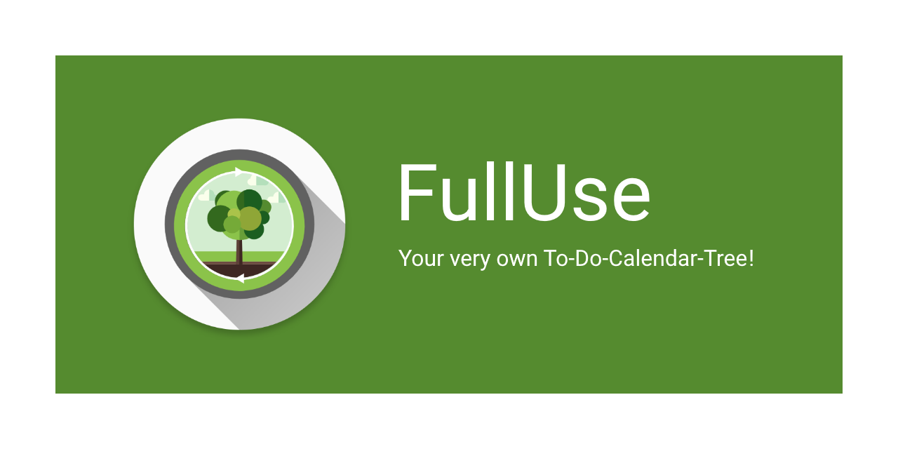

# FullUse
FullUse is a to-do list application which separates tasks into short-term and long-term ones so that users do not lose sight of their long-term aspirations whilst working on things that they have to do in the short term.

On top of the smart to-do list, FullUse offers:
* A built-in calendar which allows users to manage their events and calculate how much free time they have per day.
* Morning Reviews which brief users on what they have to do for the day.
* Gamification inspired by [ForestApp](https://www.forestapp.cc/), where users must complete tasks to grow their seed into a beautiful tree. A task completion streak must be maintained, or else the user's plant will start to lose water!

A full explanation of FullUse's features and the rationale behind the application is available in the Wiki section of our [FullUse promotional site](https://meeps123.github.io/fulluse/).